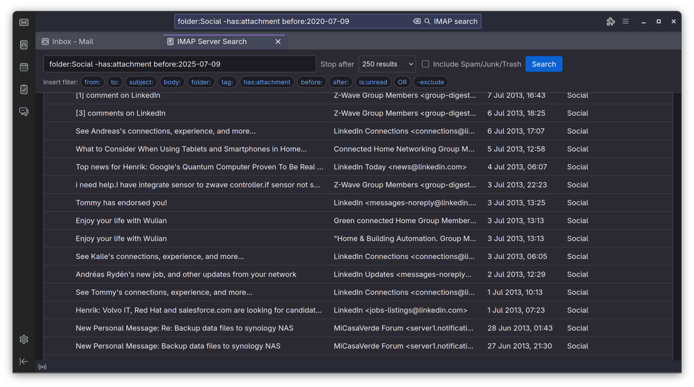
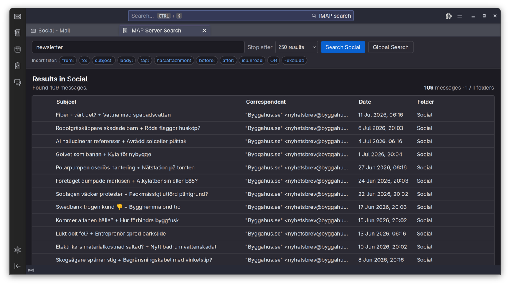
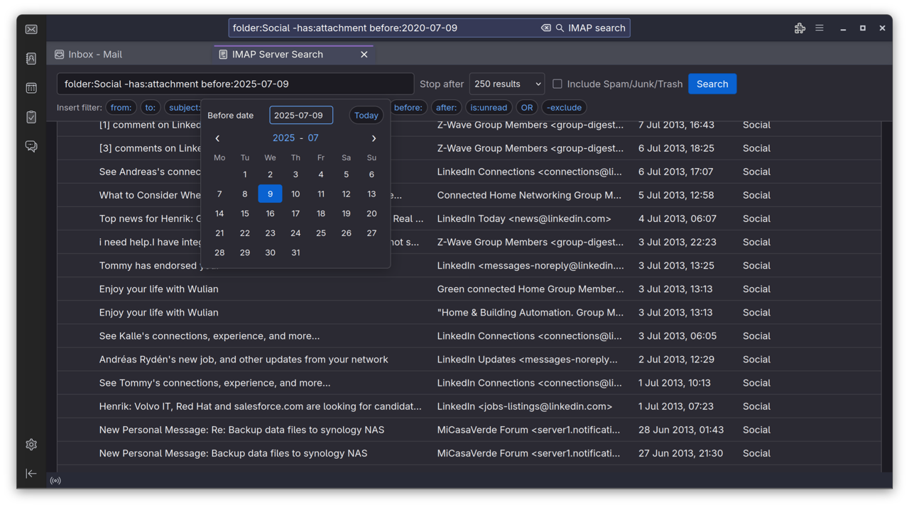
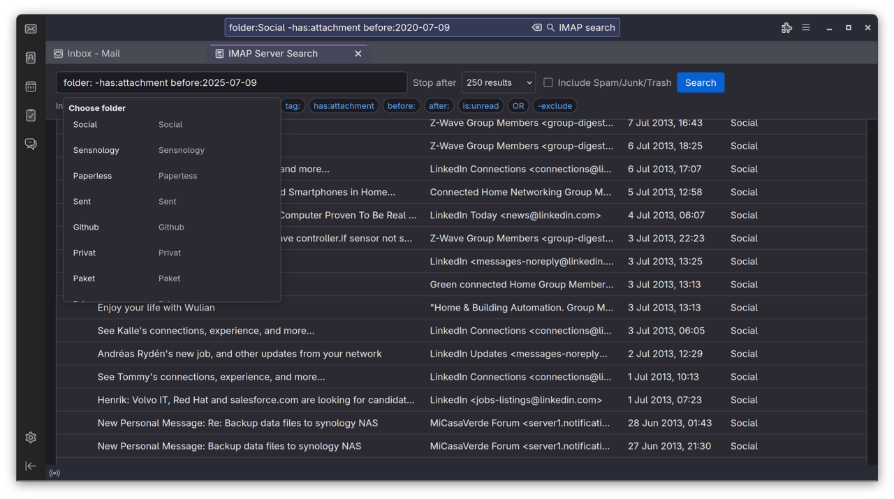
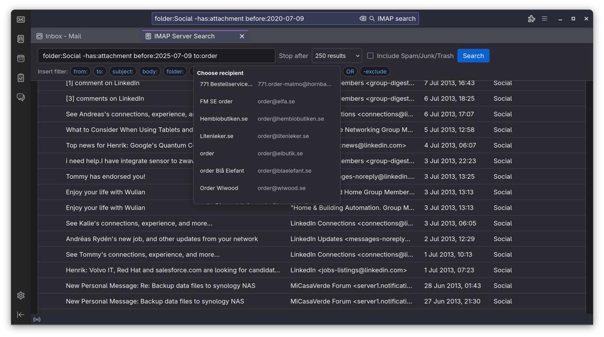

# Global IMAP Server Search

Fast server-side IMAP search for Thunderbird and Betterbird, without Gloda.

Global IMAP Server Search replaces submissions from Thunderbird's global toolbar search with direct IMAP searches across the active account. It can also turn Enter in a folder's Quick Filter field into a server search restricted to that exact folder.

## Why

Thunderbird's built-in global search depends on the local Gloda index. This extension instead asks the configured IMAP server to search the mailbox. Servers with full-text indexing, such as Dovecot with FTS Flatcurve, can answer broad searches efficiently. Dovecot is not required; the extension uses Thunderbird's normal IMAP search implementation.

## Features

- Searches Subject, From, To, and Body on the IMAP server.
- Searches every selectable folder in the active IMAP account.
- Runs exact current-folder searches from Thunderbird's Quick Filter field.
- Streams incremental results into a sortable Thunderbird tab.
- Opens messages through Thunderbird's native message display.
- Cancels broad searches and enforces a configurable result limit.
- Excludes Spam, Junk, and Trash by default.
- Remembers the result limit and junk-folder preference.
- Never uses Gloda or builds another local full-text index.

## Query syntax

| Expression | Meaning |
| --- | --- |
| `invoice` | Subject, From, To, or Body contains `invoice` |
| `"annual report"` | Search for a phrase |
| `from:alice@example.com` | Sender |
| `to:bob@example.com` | Recipient |
| `subject:invoice` | Subject |
| `body:contract` | Body |
| `folder:Archive/2025` | Exact folder path |
| `tag:Important` | Thunderbird tag / IMAP keyword |
| `has:attachment` | Messages with attachment metadata |
| `before:2026-01-01` | Before an ISO date |
| `after:2025-01-01` | After an ISO date |
| `is:read`, `is:unread` | Read state |
| `is:starred` | Starred messages |
| `-subject:draft` | Negation |
| `alice OR bob` | Explicit alternative |

Adjacent expressions are combined with AND. A bare expression is grouped as Subject OR From OR To OR Body.

The results page provides address-book, folder, tag, and ISO date pickers for relevant filters.

## Screenshots

### Global server search



### Current-folder search

Press Enter in Thunderbird's Quick Filter field to search the current folder directly on the IMAP server.



### Search helpers

The search page includes quick selectors for ISO dates, folders, and address-book contacts.

| ISO date picker | Folder picker |
| --- | --- |
|  |  |



## Compatibility

The first public release declares Thunderbird 115 through 152 compatibility. The toolbar, folder search, server search, results view, cancellation, and message opening have been successfully exercised on Thunderbird 152 and on Betterbird 140.12 ESR using the production extension ID. Because the extension contains an Experiment API and interacts with Thunderbird internals, compatibility is deliberately capped at `152.*` until newer branches have been tested.

Betterbird based on a compatible Thunderbird branch is supported on a best-effort basis.

## Installation

### GitHub release

The extension is distributed from the project's [GitHub Releases](https://github.com/henrikekblad/thunderbird-imap-search/releases) page. It cannot currently be listed on Thunderbird Add-ons because new add-ons with unpublished Experiment APIs are temporarily not accepted. The Experiment is required for online IMAP search and integration with Thunderbird's search controls.

1. Download `global-imap-server-search-VERSION.xpi` from the latest release.
2. Open **Add-ons and Themes** in Thunderbird or Betterbird.
3. Open the tools menu and choose **Install Add-on From File**.
4. Select the downloaded XPI and approve the installation.

Thunderbird displays a full/unrestricted-access warning because the extension uses an Experiment API. The extension does not access the operating system or send data to the developer. See [Reviewer notes](REVIEWER_NOTES.md) and the [privacy policy](PRIVACY.md) for details.

GitHub installations do not currently update automatically. Watch the repository or check the Releases page for newer compatible versions before upgrading Thunderbird or Betterbird.

### Development build

1. Open **Add-ons and Themes** in Thunderbird or Betterbird.
2. Open the tools menu and choose **Debug Add-ons**.
3. Choose **Load Temporary Add-on**.
4. Select this repository's `manifest.json`.

Temporary installations are removed when Thunderbird or Betterbird restarts.

## Build

The XPI contains the readable source directly. There is no transpilation, bundling, minification, dependency download, or generated JavaScript.

Requirements:

- POSIX shell
- Node.js
- Python 3
- 7-Zip (`7z`)

Build and validate:

```sh
./scripts/package.sh
```

The unsigned archive is written to `dist/global-imap-server-search-VERSION.xpi`.

## Privacy

The extension has no telemetry, advertising, remote code, or developer-operated service. Search expressions are sent only through Thunderbird to the user's configured IMAP server. Address books are accessed locally for `from:` and `to:` suggestions.

See the complete [privacy policy](PRIVACY.md).

## Security

See [SECURITY.md](SECURITY.md) for reporting security issues.

## Contributing

See [CONTRIBUTING.md](CONTRIBUTING.md). Bug reports should not include private message contents, addresses, credentials, or unredacted logs.

## License

Global IMAP Server Search is available under the [Mozilla Public License 2.0](LICENSE).

Copyright 2026 Henrik Ekblad / Sensnology AB.
